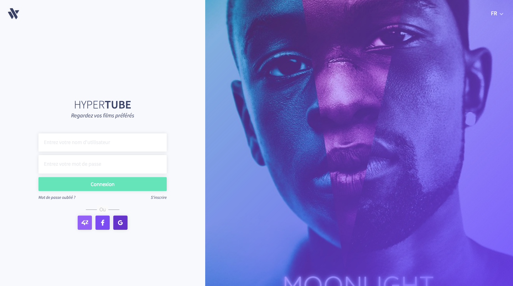
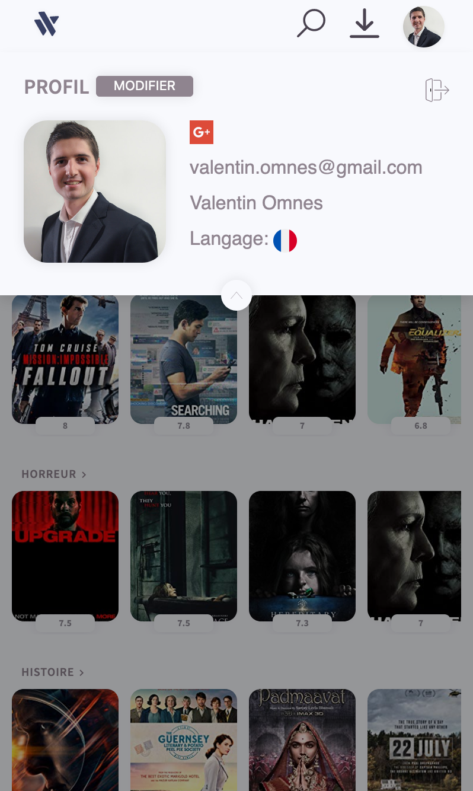
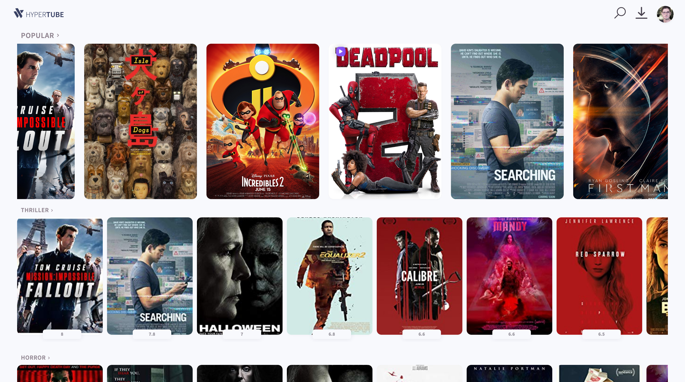
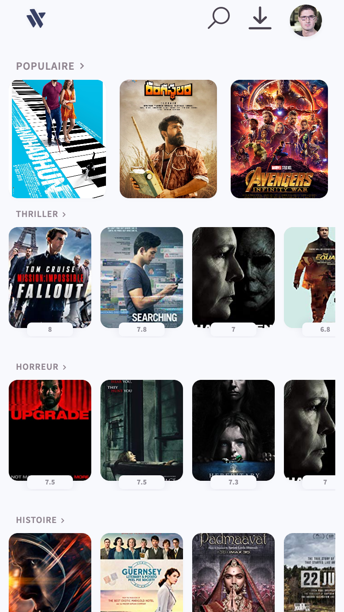
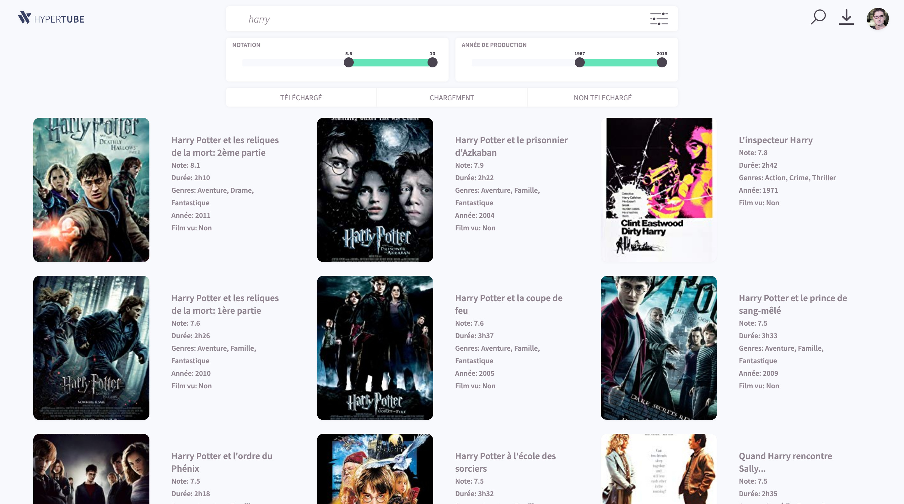
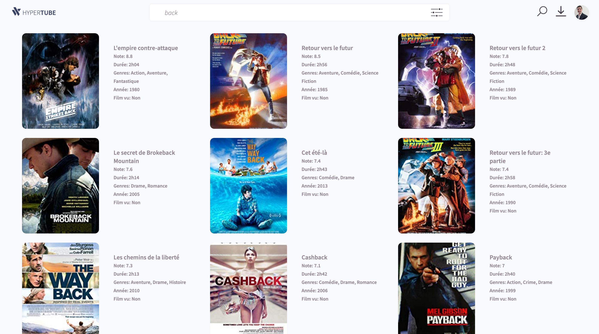
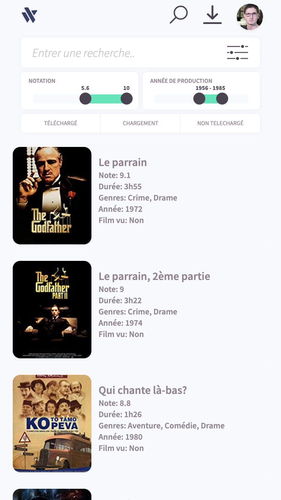
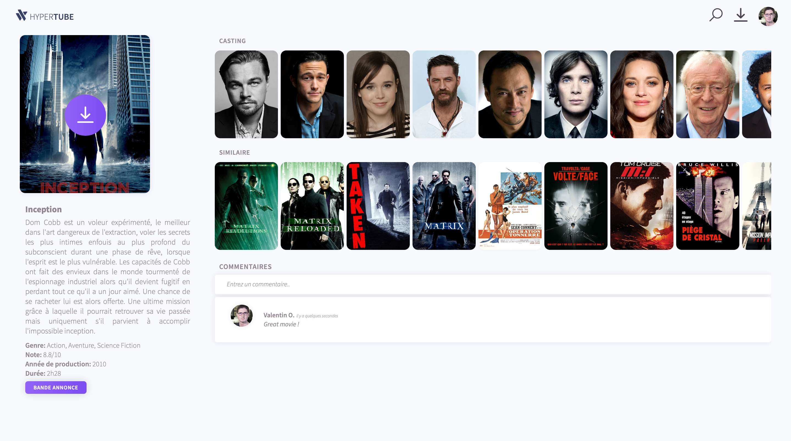
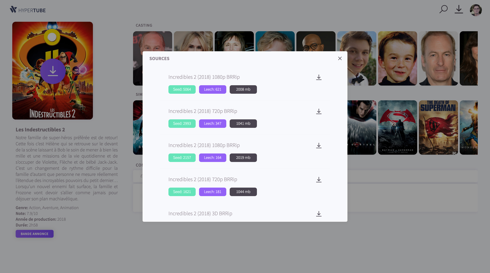
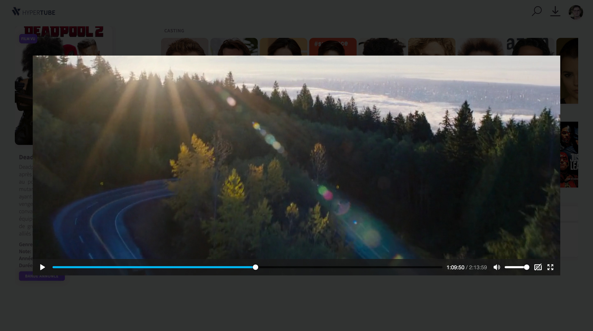

# Hypertube
This project proposes to create a web application that allows the user to research and watch videos. The player will be directly integrated to the site, and the videos will be downloaded through the BitTorrent protocol.

This is a group project realised during my studies at 'Ecole 42'.
We have designed and realised this project from scratch using VueJS, Golang, MongoDB(using aggregates), NodeJS, Websockets (socket.io), HTML, SASS (compiled CSS), Apache, Docker and Kubernetes.

We have done everything from scratch with a responsive web design (HTML/CSS framework).
We handle multi languages with i18n, the authentication through Oauth(Google, 42 API (our school oauth), Facebook...) is available.

The movie database comes from [IMDb](https://www.imdb.com/) and [TMDb](https://www.themoviedb.org) API.

We have programmed from scratch the torrent client implementing (download torrents) the BitTorrent Protocol in NodeJS.
- https://wiki.theory.org/index.php/BitTorrentSpecification
- http://www.bittorrent.org/beps/bep_0000.html
- http://www.bittorrent.org/beps/bep_0015.html

I have done completely by myself the Golang API (Manage movies (search, movie page, list categories...), user(oauth...), comments...) with unit tests, the script to populate the movie database in Golang (download files, parse, scrape websites and save in the database) and done a big part of the front in VueJS.

## Features

### Profile
- Create an account
- Reset your password through an unique link sent by email (using third party MailJet)
- Modified your private data
- Add/Edit

### List movies
- List the movies by categories and sorted by relevance
- See a page with all the movies of a category
- Load more data on maximum scroll automatically (no pages)

### Search
- Search for movies by name, year, rating and status

### See movie
- Movie data
- Add/Get comments
- List/Download the torrents
- Watch the movie

